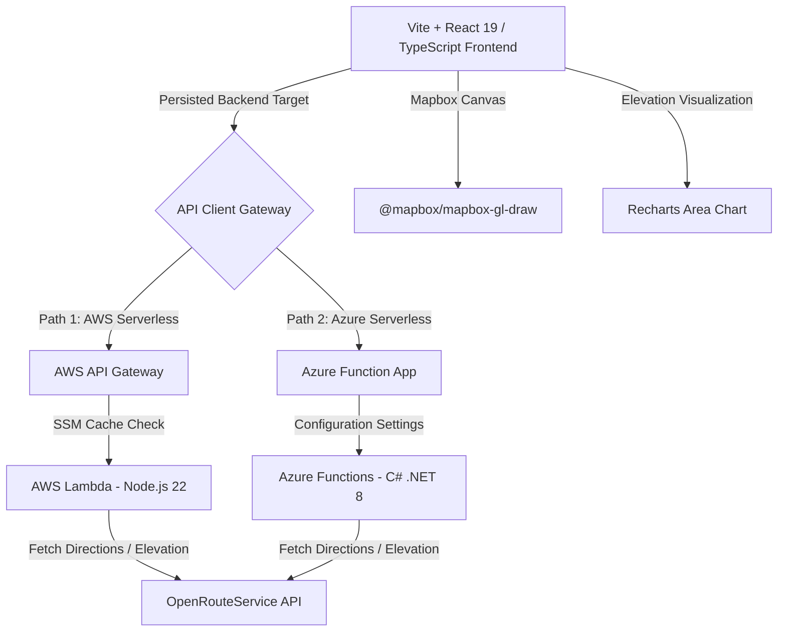

# Technical Portfolio Breakdown: Running Route Planner

**Project Name:** Running Route Planner  
**Role:** Lead Full-Stack & Serverless Engineer  
**Live Site:** [running.sheng.nz](https://running.sheng.nz) (Frontend on Vercel)  
**Architecture:** React 19 + TypeScript + Vite | AWS Serverless (Node.js 22) & Azure Serverless (C# .NET 8)

---

## 📌 Project Overview

Running Route Planner is an intelligent, interactive web application designed for runners to seamlessly discover, draw, customize, and export running routes. The application addresses key limitations in existing fitness tools by providing **distance-based loop auto-generation**, **interactive hand-drawing with intelligent snapping** to pedestrian pathways, **real-time elevation profiling**, and **Garmin-compatible GPX 1.1 exports**.

To achieve high portability and robustness, the project is built on a **multi-cloud serverless backend architecture** (AWS SAM + Node.js 22 and Azure Functions v4 + C# .NET 8) backed by OpenRouteService (ORS) and Mapbox GL JS.

---

## ⚙️ Core Architecture & Tech Stack

### 1. Modern Frontend
*   **Framework:** React 19, TypeScript, and Vite for blazing-fast builds and HMR.
*   **Mapping & Interactions:** Mapbox GL JS (`react-map-gl`) integrated with `@mapbox/mapbox-gl-draw` for interactive drawing canvas.
*   **Visualizations:** Recharts for dynamic elevation profile rendering.
*   **Component Library:** Accessible, themeable UI components utilizing Radix UI primitives and custom Tailwind CSS styles.

### 2. Multi-Backend Serverless Architecture
*   **AWS Path (Node.js 22):** Deployed via AWS SAM (Serverless Application Model) with Lambda and API Gateway, featuring local configuration caching and AWS SSM Parameter Store integrations.
*   **Azure Path (C# .NET 8):** Deployed on Azure Functions v4 Isolated Worker mode, leveraging strong typing and compilation checks.
*   **Routing API:** OpenRouteService (ORS) Pedestrian routing engine.

---

## 🛠️ Deep Technical Details & Engineering Solutions

### 1. Optimizing Freehand Drawings (Douglas-Peucker Algorithm)
*   **The Problem:** When users draw a route freehand on a Mapbox canvas, the browser fires mouse/touch events that generate hundreds of geographic coordinates. Sending these coordinates directly to a routing API results in huge payloads, high latency, API rate-limit exhaustion, or 400 Bad Request errors.
*   **The Solution:** The frontend applies the **Douglas-Peucker line-simplification algorithm** (`simplifyLineDP`) to reduce points within a configurable distance tolerance (approx. 50 meters). If the coordinate count remains above a threshold (50 waypoints), the system downsamples the array evenly (`extractWaypoints`). 
*   **The Impact:** Snapping is instant, backend payloads are reduced by up to **90%**, and ORS routing request reliability remains at **100%**.

### 2. Algorithmic Route Auto-Generation
*   **Loop Routes:** Configured using the OpenRouteService `round_trip` API, combining user target distance, random seeds, and difficulty-based distance elongation factors.
*   **One-Way Routes:** Generated by computing a destination point at a randomized heading using the **Haversine destination calculation** (`computeDestination`) at a scaled straight-line distance, then querying ORS for the walkable route between the start and computed end coordinates.

### 3. Defensive API Integration & Resilience
*   **Avoid-Feature Fallbacks:** Different regions have different trail/step properties. If a routing request fails with a `400 Bad Request` because of strict options (e.g., "avoid steps"), the backend intercepts the message, strips the failing parameters, and automatically retries the request (fallback).
*   **API Cost Optimization:** In the Node.js backend, AWS SSM Parameter Store calls are cached at the module level (`cachedApiKeyPromise`). This prevents AWS from charging for Parameter Store queries on every single API invocation.
*   **Race-Condition Prevention:** If a user clicks "Generate Route" multiple times rapidly, the UI cancels previous active requests using `AbortController.abort()`, ensuring the final rendered state is correct and avoiding UI state fragmentation.

### 4. Enterprise-Grade GPX Export
*   **C# Implementation:** C# utilizes XML LINQ (`XDocument`) for strong type-safe generation of GPX 1.1 schemas. This protects against XML injection vulnerabilities.
*   **Node.js Implementation:** Node.js implements custom character escaping (`xmlEscape`) and filename sanitization to ensure security.
*   **Data Enrichment:** Outputs coordinates combined with high-precision elevation data, synced timestamp tracking, and metadata to be immediately ready for Garmin Connect imports.

---

## 💡 The Most Complex Technical Problem Solved Recently

### **Problem: Real-time Pedestrian Snapping of Hand-Drawn Routes**
When a user draws a line on a map, the coordinates do not follow streets, hiking trails, or footpaths. Directly displaying the hand-drawn line results in inaccurate mileage, no elevation data, and an unusable file for Garmin devices. To solve this, we needed to "snap" the raw coordinates to walkable paths in real-time.

### **Solution Implementation:**
1.  **Client-Side Simplification:** Captured raw points from Mapbox Draw, and immediately ran them through a recursive Douglas-Peucker algorithm. This transformed a noisy 300-point line into a clean, geometric 15-point representation of the runner's intent.
2.  **Perimeter & Mode Detection:** Created a utility to analyze coordinate distance offsets between the start and end of the drawing. If they fell within $220\text{m}$ (0.002 degrees), the app automatically set the mode to `loop` and closed the polygon; otherwise, it treated it as a `one-way` path.
3.  **Backend Snapping Service:** Fed the simplified coordinates to the backend (AWS/Azure) as guiding waypoints. The server structured a custom GeoJSON directions request, fetching walkable paths, snapping nodes to pedestrian pathways, and returning rich elevation values (`elevation = true`).
4.  **UI State Handling & Memory Optimization:** Mapbox draw layers are notorious for memory leaks when re-instantiated during React re-renders. Solved this by storing callbacks in mutable refs (`onDrawingCompleteRef.current`) and decoupling the drawing manager lifecycles from the component's stateful updates.

---

## 🧪 Testing & Code Quality

*   **Frontend Tests:** Vitest tests check Haversine formulas, Douglas-Peucker simplification boundaries, loop perimeter estimations, and waypoint extraction.
*   **Node.js Tests:** Mocked API Gateway request events to test input parameter sanitization and security boundary validation (e.g., longitude coordinates between -180 and 180).
*   **C# Tests:** Unit tests verifying `OpenRouteServiceClient` behaviors and GPX schema exports.
*   **Type Safety:** 100% strict TypeScript types shared across the UI components, mapping layer, and API callers.
